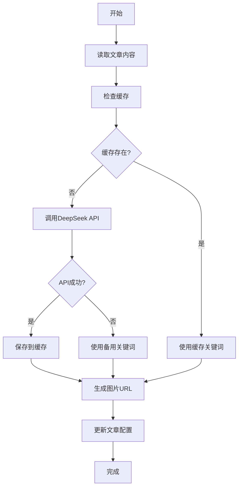

# AI关键词生成功能使用指南

## 🎯 功能概述

使用DeepSeek AI大模型分析文章内容，自动生成更精准的图片关键词，让配图更加贴合文章主题。

## 🚀 主要特性

- **AI智能分析**：使用DeepSeek API分析文章标题、内容和标签
- **精准关键词**：生成适合图片搜索引擎的英文关键词
- **智能缓存**：避免重复API调用，提高效率
- **备用机制**：API不可用时自动使用传统关键词匹配
- **批量处理**：一次性处理所有文章

## 📁 文件结构

```
scripts/
├── ai-keyword-generator.rb    # AI关键词生成脚本
├── generate-post-images.rb    # 更新后的配图生成脚本
└── test-ai-keywords.rb        # 测试脚本

_data/
├── ai_keywords.yml            # AI生成的关键词配置
└── ai_keywords_cache.yml      # 关键词缓存文件
```

## 🔧 安装配置

### 1. 获取DeepSeek API Key

1. 访问 [DeepSeek官网](https://platform.deepseek.com/)
2. 注册账号并登录
3. 在API管理页面创建API Key
4. 复制API Key备用

### 2. 设置环境变量

```bash
# 设置DeepSeek API Key
export DEEPSEEK_API_KEY="your_deepseek_api_key_here"

# 或者添加到 ~/.bashrc 或 ~/.zshrc
echo 'export DEEPSEEK_API_KEY="your_deepseek_api_key_here"' >> ~/.bashrc
source ~/.bashrc
```

### 3. 验证配置

```bash
# 测试AI关键词生成功能
ruby scripts/test-ai-keywords.rb
```

## 📖 使用方法

### 方法一：完整流程（推荐）

```bash
# 1. 生成AI关键词
ruby scripts/ai-keyword-generator.rb

# 2. 使用AI关键词生成配图
ruby scripts/generate-post-images.rb --update-posts

# 3. 构建网站
bundle exec jekyll build
```

### 方法二：仅生成关键词

```bash
# 只生成AI关键词，不更新文章
ruby scripts/ai-keyword-generator.rb
```

### 方法三：测试功能

```bash
# 测试AI关键词生成（使用示例文章）
ruby scripts/test-ai-keywords.rb
```

## 🤖 AI关键词生成原理

### 提示词设计

AI会根据以下信息生成关键词：
- **文章标题**：核心主题
- **文章标签**：分类信息
- **文章内容**：前500字符摘要

### 关键词格式

- 使用英文关键词或短语（2-4个单词）
- 使用连字符连接，如：`cryptocurrency-trading-charts`
- 适合图片搜索引擎（Unsplash、Pexels等）

### 示例输出

| 文章主题 | AI生成关键词 |
|---------|-------------|
| 币安交易所下载 | `cryptocurrency-exchange-trading` |
| 银行卡冻结 | `frozen-bank-card-money` |
| 交易图表分析 | `trading-charts-analysis` |
| 法律合规风险 | `legal-compliance-risk` |

## 📊 性能优化

### 智能缓存机制

- **缓存文件**：`_data/ai_keywords_cache.yml`
- **缓存策略**：基于文章标题、内容和标签的哈希值
- **缓存更新**：只有内容变化时才重新调用API

### API调用优化

- **请求频率**：每次调用间隔2秒，避免API限制
- **错误处理**：API失败时自动使用备用关键词
- **批量处理**：一次性处理所有文章

## 🔄 工作流程



## 📈 效果对比

### 传统关键词匹配

```
文章: "银行卡被冻结了怎么办？"
传统关键词: "cryptocurrency-blockchain"
```

### AI生成关键词

```
文章: "银行卡被冻结了怎么办？"
AI关键词: "frozen-bank-card-money"
```

**优势**：AI关键词更精准，配图更贴合文章主题

## 🛠️ 故障排除

### 常见问题

1. **API Key未设置**
   ```
   Warning: DEEPSEEK_API_KEY not set, using fallback keyword
   ```
   **解决**：设置正确的环境变量

2. **API调用失败**
   ```
   Error calling DeepSeek API: 401 Unauthorized
   ```
   **解决**：检查API Key是否正确

3. **网络连接问题**
   ```
   Error calling DeepSeek API: Connection timeout
   ```
   **解决**：检查网络连接，稍后重试

### 调试模式

```bash
# 启用详细输出
ruby scripts/ai-keyword-generator.rb 2>&1 | tee ai_keywords.log
```

## 📋 配置选项

### AI关键词生成器配置

```ruby
# 在 ai-keyword-generator.rb 中修改
@deepseek_api_url = 'https://api.deepseek.com/v1/chat/completions'
model: 'deepseek-chat'          # 模型名称
max_tokens: 50                  # 最大token数
temperature: 0.3                # 创造性参数
```

### 缓存配置

```ruby
@cache_file = '_data/ai_keywords_cache.yml'  # 缓存文件路径
```

## 🔮 未来扩展

### 支持的AI服务

- [x] DeepSeek API
- [ ] OpenAI GPT API
- [ ] Claude API
- [ ] 本地大模型

### 功能增强

- [ ] 多语言关键词支持
- [ ] 图片风格偏好设置
- [ ] 批量关键词优化
- [ ] 关键词效果分析

## 📞 技术支持

### 日志文件

- `ai_keywords.log` - AI关键词生成日志
- `_data/ai_keywords_cache.yml` - 关键词缓存

### 调试命令

```bash
# 查看缓存内容
cat _data/ai_keywords_cache.yml

# 清除缓存重新生成
rm _data/ai_keywords_cache.yml
ruby scripts/ai-keyword-generator.rb
```

---

**注意**：首次使用需要设置DeepSeek API Key。如果没有API Key，系统会自动使用传统关键词匹配作为备用方案。
